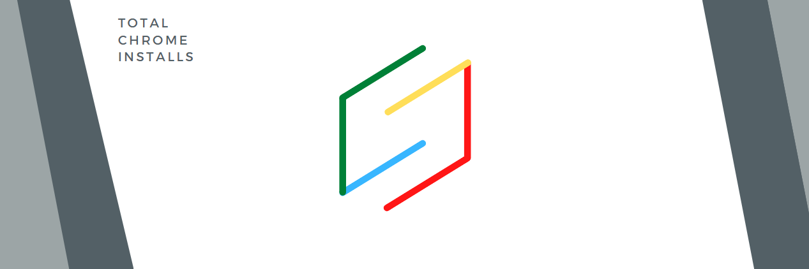

# Chrome-extension-total-installs

Chrome extension that checks total amount of installs for other chrome extension

Obstacles

- creating button overlay with cool animation
- csv parsing
- issue with hover, showing total and also Original button
- issue installing an external library due to manifest v3
  --> 
  Top one would fail, I think it has something to do with path
  
  This goes from current directory up. i.e knows its path
